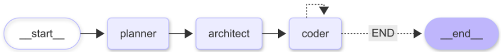

# 🛠️ Coder Buddy

Coder Buddy is a multi-agent AI code generation system built using LangGraph, Groq, and tool-calling agents. It transforms natural language software requirements into complete multi-file projects by orchestrating specialized AI agents that mimic a real-world software development workflow.

---

## 🚀 Features

* Multi-agent architecture for software generation
* Planner Agent for requirement analysis
* Architect Agent for task decomposition
* Coder Agent with tool-calling capabilities
* Automated file creation and management
* Structured outputs using Pydantic models
* LangGraph-powered workflow orchestration
* Generates complete HTML, CSS, and JavaScript applications from user prompts

---

## 🏗️ Architecture



### Planner Agent

Analyzes user requirements and creates a structured project plan.

### Architect Agent

Transforms the project plan into implementation tasks, defining files and development steps required for the final solution.

### Coder Agent

Executes implementation tasks, generates source code, and writes files using tool-calling workflows.

---

## 🛠️ Tech Stack

* Python
* LangGraph
* LangChain
* Groq
* Pydantic
* UV Package Manager

---

## 📂 Project Structure

```text
Coder_Buddy/
│
├── agent/
│   ├── graph.py
│   ├── prompts.py
│   ├── states.py
│   └── tools.py
│
├── generated_project/
│   ├── index.html
│   ├── styles.css
│   └── app.js
│
├── main.py
├── pyproject.toml
├── uv.lock
└── README.md
```

---

## ⚙️ Installation

### Prerequisites

* Python 3.11+
* UV Package Manager
* Groq API Key

### Setup

Create and activate a virtual environment:

```bash
uv venv
```

Install dependencies:

```bash
uv pip install -r pyproject.toml
```

Create a `.env` file and add:

```env
GROQ_API_KEY=your_api_key_here
```

Run the application:

```bash
python main.py
```

---

## 🧪 Example Prompts

* Build a colourful modern todo app in HTML, CSS, and JavaScript.
* Create a simple calculator web application.
* Build a responsive landing page for a SaaS company.
* Create a FastAPI-based blog API with SQLite.

---

## 🔮 Future Improvements

* Tester Agent for automated validation
* Debugger/Fixer Agent for self-healing workflows
* React and Next.js project generation
* Multi-language support
* Automated project execution and testing

---

## 📸 Generated Example

The repository includes a generated Todo Application produced entirely from a natural language prompt using the multi-agent workflow.

---

## 👨‍💻 Author

Anavi Gupta
